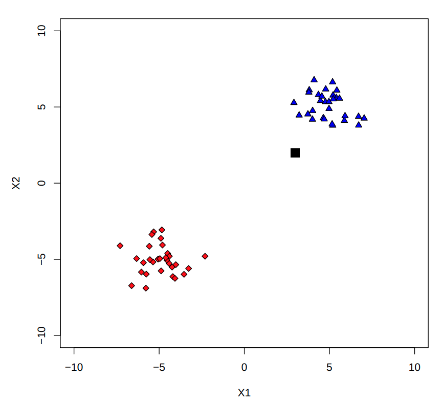
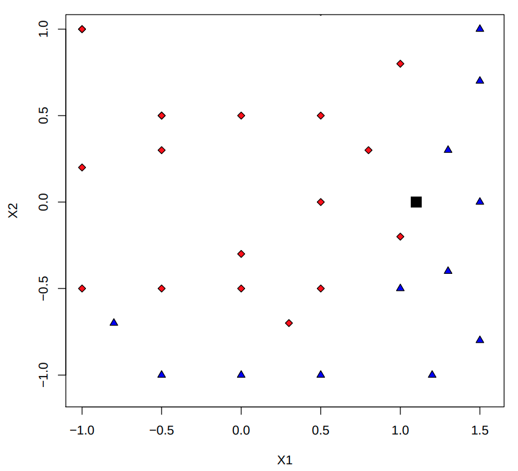
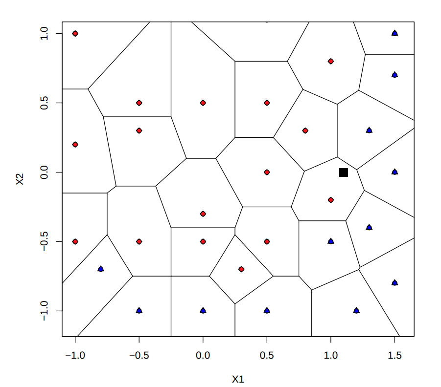
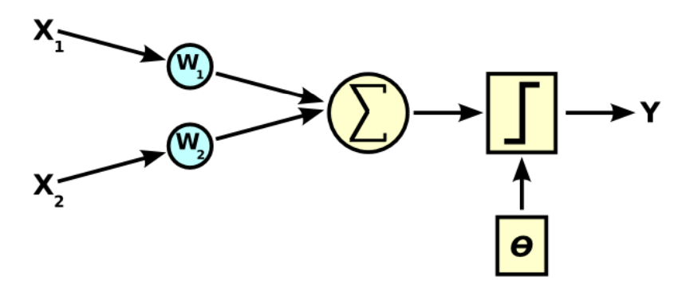

# Intelligence Artificielle

[Intelligence Artificielle](#intelligence-artificielle)
- [Intelligence Artificielle](#intelligence-artificielle)
- [Pose des bases](#pose-des-bases)
- [Classification, classement, régression](#classification-classement-régression)
- [Principaux types](#principaux-types)
- [Apprentissage supervisé](#apprentissage-supervisé)
  - [Définition](#définition)
  - [Les différentes représentations](#les-différentes-représentations)
  - [Les K plus proches voisins](#les-k-plus-proches-voisins)
    - [Principe](#principe)
      - [KNN pour la classification](#knn-pour-la-classification)
      - [KNN pour la régression](#knn-pour-la-régression)
  - [Les arbres de décisions](#les-arbres-de-décisions)
    - [Représentation](#représentation)
    - [Construction et évaluation](#construction-et-évaluation)
    - [Quelques propriétés](#quelques-propriétés)
    - [Choix de l'attribut](#choix-de-lattribut)
    - [Elagage des décisions](#elagage-des-décisions)
      - [Pourquoi élaguer ?](#pourquoi-élaguer-)
      - [Le pré-élagage](#le-pré-élagage)
      - [Le post-élagage](#le-post-élagage)
      - [Estimation du coût](#estimation-du-coût)
  - [Le perceptron](#le-perceptron)
    - [Définition](#définition-1)
    - [Un perceptron à 2 entrées (wikipedia)](#un-perceptron-à-2-entrées-wikipedia)
    - [Principe](#principe-1)
    - [Définition du risque empirique](#définition-du-risque-empirique)
    - [Comment apprendre le vecteur de poids ?](#comment-apprendre-le-vecteur-de-poids-)
    - [L'algorithme](#lalgorithme)

# Pose des bases

> Qu’est ce que l’apprentissage (automatique/artificiel)

Il s’agit de la construction d’un modèle de la réalité à partir de
données. On cherche à créer des méthodes permettant à un ordinateur
de remplir des taches (difficiles) grâce à un processus
d’apprentissage.

> Où trouve t-on de l’apprentissage

 - Reconnaissance de la parole.
 - Diagnostique médical.
 - Moteurs de recherche.
 - Les jeux.
 - Conduite autonome.

# Classification, classement, régression

 - **Classification / Clustering** : Regrouper des ensembles
d’exemples non supervisés en classes.
 - **Classement / classification** :  Reconnaître des classes à
partir de leurs descripteurs.
 - **Régression** : Classement sur des valeurs numériques.

 # Principaux types

 - **Apprentissage supervisé** : Apprentissage sur des
exemples connus (étiquetage des données par un oracle).
 - **Apprentissage non supervisé** : Apprentissage sur des
exemples non connus.
 - **Apprentissage semi-supervisé** : Apprentissage
intermédiaire (exemples étiquetés/non étiquetés). On y
trouve par exemple l’apprentissage actif.
 - **Apprentissage par renforcement** : Apprentissage basé
sur des observations/récompenses. L’algorithme agit sur
l’environnement qui en retour guide l’algorithme.

# Apprentissage supervisé

## Définition

- A partir de la base d’apprentissage S = (xi, ui) 1≤i≤N,
- on va chercher un une loi de dépendance entre x et u.
-  Par exemple,
    - une fonction h aussi proche de f (fonction cible) que
possible tel que ui = f(xi)
    -  une distribution de probabilité P(xi, ui)

## Les différentes représentations
 - Si f est une fonction continue on parle alors de régression.
 - Si f est une fonction discrète on parle alors de
classification.
 - Si f est une fonction binaire on parle alors d’apprentissage
de concept.

 

## Les K plus proches voisins

 - Classification et régression.
 - Facile à comprendre.
 - Quelques paramètres : k, choix de la mesure de distance.

### Principe

> Comment classer le carré noir ?

 - On cherche le plus proche voisin.
 - On tag le nouveau point avec la classe correspondante.

> Diagramme de Voronoi

 - Découpage du plan en cellules.
 - Chaque cellule est créée à partir d’un exemple
d’apprentissage.
 - Chaque cellule forme l’ensemble des points les plus
proches de l’exemple correspondant.

> Cas des points aberrants
 - Un point aberrant change fortement la frontière apprise.
 - Comportement non souhaité.
> Une solution
 - Utiliser plus de 1 voisin.
 - Compter les k plus proches voisins et prendre la classe
dominante.
 - Pour étiqueter un point, on choisit la classe dominante
parmi les k plus proches voisins.

#### KNN pour la classification
 - Données :
    - L’ensemble des points d’apprentissage (xi, ui).
    - Le nouveau point à classer x.
 - Algorithme :
    - Toutes les distances D(xi, x).
    - Sélection des k plus proches exemples x1 . . . xk .
    - Choix de la classe la plus présente parmi les u1 . . . uk
correspondants.

#### KNN pour la régression

 - Données :
    -  L’ensemble des points d’apprentissage (xi, ui).
    - Le nouveau point x.
 - Algorithme :
    - Toutes les distances D(xi, x).
    - Sélection des k plus proches exemples x1 . . . xk .
    - <!-- $ u = \frac{1}{k}\sum_{j=1}^{k}u_j $ --> 

## Les arbres de décisions

### Représentation
 - Représentation commode des concepts lorsque les
exemples s’expriment comme des vecteurs d’attributs à
valeurs discrètes.
 - En entrée : la description d’exemple.
 - En sortie : une classe.
 - Chaque noeud de l’arbre correspond à une question
portant sur un attribut.
 - Classification d’un objet réalisée par une suite de tests sur
les attributs qui le décrivent.
### Construction et évaluation
 - Quels attributs sélectionner pour construire l’arbre ?
 - Comment évaluer un arbre ? A priori on souhaite
minimiser le nombre de tests (en moyenne) pour classifier
un exemple (il existe une borne max sur le nombre
d’attributs).
### Quelques propriétés
 - Une variable aléatoire w possède une entropie H(u)
définit par :

<!-- $$
    H(u) = - \sum_{i \in D_u} p(i) \times log_2(p(i))
$$ --> 

 - L’entropie de w conditionnée par a est définie par :
<!-- $$
H(u|A) = - \sum_{i,j \in D_u \times D_a} p(i,j) \times log_2(p(i|j))
$$ --> 

  - On peut donc estimer les probabilités :

<!-- $$
    H(u|a) = \frac{I}{n}J(a=vrai) + \frac{r}{n}J(a=faux)    
$$ --> 

avec
<!-- $$
    J(a=vrai) = - \sum_{j=1}^{U}\frac{I_j}{I}log_2(\frac{I_j}{I})
$$ --> 

<!-- $$
    J(a=faux) = - \sum_{j=1}^{U}\frac{r_j}{r}log_2(\frac{r_j}{r})
$$ --> 

### Choix de l'attribut
 - On veut choisir l’attribut qui possède la plus grande
corrélation avec la répartition des classes.
 - On va donc chercher à minimiser l’entropie, prendre le plus petit H(u|a)

### Elagage des décisions

#### Pourquoi élaguer ?

 - L’arbre précédemment construit est dit Tmax : chaque
feuille est pure.
 - Il y a un risque de sous estimer la probabilité d’erreur.
  
#### Le pré-élagage

 - On cesse de diviser un noeud lorsque la pureté des points
est suffisantes (inférieure à un certain seuil).
 - Utilisation de critères locaux (à une feuille) : on peut
manquer un très bon développement.
 - Donc, utilisation du post-élégage.

#### Le post-élagage
 - Élaguer l’arbre lorsqu’il est parfaitement développé.
 - Utiliser un ensemble indépendant de l’ensemble
d’apprentissage (ensemble de validation).
 -  Mesurer l’erreur commise sur cet ensemble.

#### Estimation du coût

Choisir le noeud v qui minimise :

<!-- $$
    w(T_k,v) = \frac{MC_{ela}(v,k) - MC(v,k)}{n_k \times (nt(v,k) - 1)} 
$$ --> 

- <!-- $MC_{ela}(v,k)$ --> : nombre d’exemples de l’ensemble d’apprentissage mal classés <strong>par</strong> le noeud v de Tk dans l’arbre élagué à v.

 - <!-- $MC(v,k)$ -->  : nombre d’exemples de l’ensemble d’apprentissage mal classés <strong>sous</strong> le noeud v de Tk dans l’arbre <strong>non</strong> élagué à v.

 - <!-- $n_k$ -->  : nombre de feuilles de <!-- $T_k$ --> .
 - <!-- $nt(v, k)$ -->  : nombre de feuilles du sous-arbre de  situé sous le noeud v

**On cherche le meilleur compromis entre le taux d’erreur
apparent et la taille.**

## Le perceptron

### Définition
 - Le perceptron est un classifieur linéaire.
 - Il peut être vu comme un réseau de neurones simplifié.
 - Il a une seule sortie à laquelle toutes les entrées sont
connectées.

### Un perceptron à 2 entrées (wikipedia)

### Principe
 - A partir de l’échantillon d’apprentissage, il faut trouver le
vecteur de poids w et le biais, tel que :

<!-- $$
w.x + biais = \left\{
    \begin{array}{ll}
        \geq 0 \\
        < 0
    \end{array}
\right.
\Rightarrow
\left\{
    \begin{array}{ll}
        u_1 \\
        u_2
    \end{array}
\right.
$$ --> 

 - En associant u = 1 pour u1 et u = −1 pour u2, on cherche
donc :

<!-- $w.x.u > 0, \forall(x_i,u_i) \in S$ --> 

### Définition du risque empirique
Risque empirique(w) = <!-- $- \sum_{x_j \in M}w.x_j.u_j$ --> 

avec M l’ensemble des exemples d’apprentissage mal classés
par le perceptron de poids w.

### Comment apprendre le vecteur de poids ?
Descente de gradient :

<!-- $w(t + 1) = w(t) - \eta x_i u_i$ --> 

> η est appelé le pas d’apprentissage

### L'algorithme

 - Passer en revue chaque exemple dans l’échantillon
d’apprentissage et tester la réponse y produite par le
perceptron par rapport à la réponse désirée u.
 - Si les deux réponses sont identiques, l’exemple est bien
classé : ne rien faire.
 - Sinon, si l’exemple est incorrectement classé en w1,
ajouter ηx à w, sinon retirer ηx.
 - Ré-itérer tant que qu’il reste du temps et tant que tous les
exemples ne sont pas bien classés.